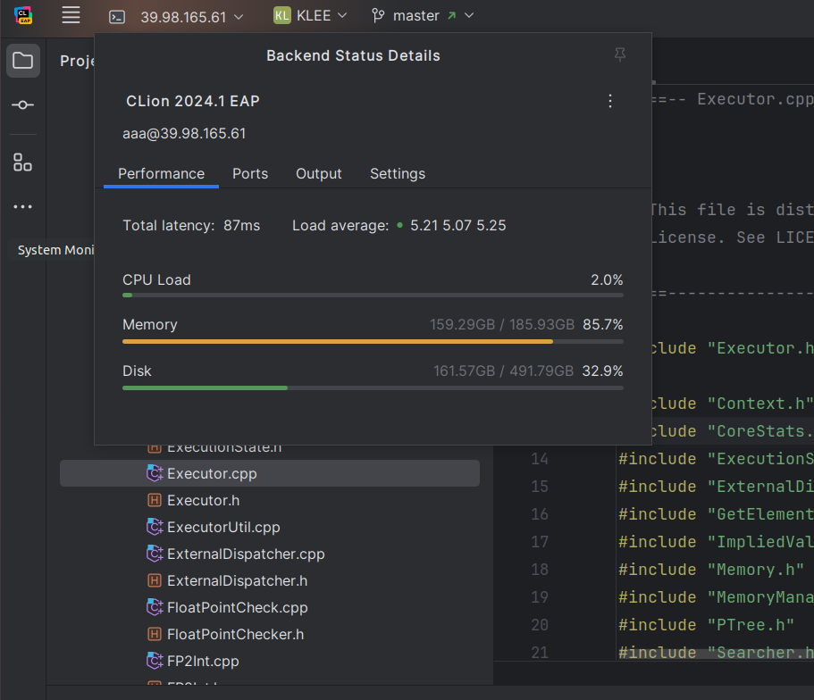
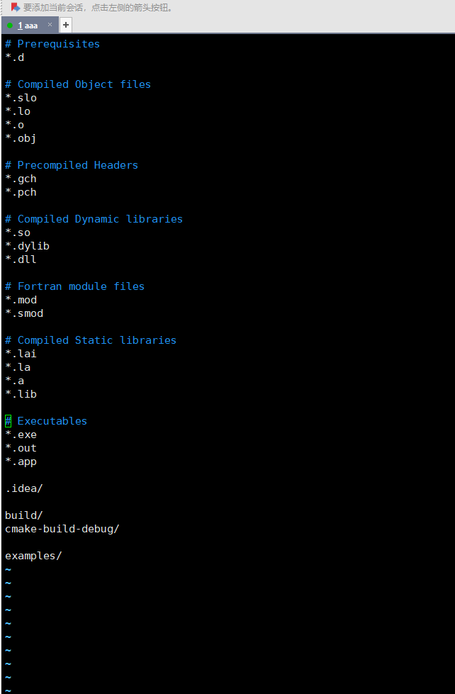

环境：ubuntu18.04  python3.6    
llvm 6.0 + z3 4.6.2 + json-c + jfs + klee 2.3-pre +gsl


**可能需要换源**

```
sudo cp /etc/apt/sources.list /etc/apt/sources.list_apk
gedit sources.list

deb http://mirrors.aliyun.com/ubuntu/ bionic main restricted universe multiverse
deb-src http://mirrors.aliyun.com/ubuntu/ bionic main restricted universe multiverse
deb http://mirrors.aliyun.com/ubuntu/ bionic-security main restricted universe multiverse
deb-src http://mirrors.aliyun.com/ubuntu/ bionic-security main restricted universe multiverse
deb http://mirrors.aliyun.com/ubuntu/ bionic-updates main restricted universe multiverse
deb-src http://mirrors.aliyun.com/ubuntu/ bionic-updates main restricted universe multiverse
deb http://mirrors.aliyun.com/ubuntu/ bionic-proposed main restricted universe multiverse
deb-src http://mirrors.aliyun.com/ubuntu/ bionic-proposed main restricted universe multiverse
deb http://mirrors.aliyun.com/ubuntu/ bionic-backports main restricted universe multiverse
deb-src http://mirrors.aliyun.com/ubuntu/ bionic-backports main restricted universe multiverse
```

> 


0. apt-get 环境预先安装


```
0.1. sudo apt-get update

0.2. sudo apt-get install build-essential cmake curl file g++-multilib gcc-multilib git libcap-dev libgoogle-perftools-dev libncurses5-dev libsqlite3-dev libtcmalloc-minimal4 python3-pip unzip graphviz doxygen pkg-config

0.3. pip3 install lit tabulate wllvm -i https://pypi.tuna.tsinghua.edu.cn/simple
```

**tar -xvf 文件名.tar.xz**
**tar -xvf 文件名.tar.xz -C /目标目录**

1. 安装llvm 6.0，解压llvm四个包

   ```
   1.1. 将clang-tools-extra-6.0.0改名为extra，cfe-6.0.0改名为clang；
   1.2. 将compile-rt-6.0.0改名为compile-rt，llvm-6.0.0改名为llvm-6
   1.3. 将extra放入clang/tools中，clang放入llvm-6/tools中
   1.4. 将compile-rt 放入llvm-6/projects中
   1.5. mkdir build
   1.6. cd build
   1.7. cmake \
        -DCMAKE_INSTALL_PREFIX=/home/aaa/fp-solver/llvm-6/install \
        -DCMAKE_BUILD_TYPE=Release \
        -DLLVM_TARGETS_TO_BUILD=X86 \
        -DLLVM_ENABLE_RTTI=OFF \
        -DLLVM_ENABLE_EH=OFF \
        -DLLVM_ENABLE_LTO=OFF \
        -DLLVM_BUILD_LLVM_DYLIB=OFF \
        -DBUILD_SHARED_LIBS=OFF \
        ..
   1.8. make -j6
   #1.9. sudo make install
   make install
   ```


2. 编译安装Z3-4.6.2

    ```
    2. 2.1. mkdir build
       2.2. cd build 
       2.3. cmake \
           -DCMAKE_INSTALL_PREFIX=/home/aaa/fp-solver/z3-4.6.2/install \
           -DCMAKE_BUILD_TYPE=Release ..
       2.4. make -j6
       #2.5. sudo make install
       make install
    
    3. 环境变量配置：
    3.1. sudo gedit ~/.bashrc
        export LLVM6_DIR=/home/aaa/fp-solver/llvm-6/build
        export LLVM6_BIN=/home/aaa/fp-solver/llvm-6/install/bin
        export Z3_DIR=/home/aaa/fp-solver/z3-4.6.2/build
        export Z3_BIN=/home/aaa/fp-solver/z3-4.6.2/install/bin
        export PATH=$PATH:$LLVM6_DIR:$LLVM6_BIN:$Z3_DIR:$Z3_BIN
    3.2. source ~/.bashrc
    ```


4. 编译klee-uclib
   
   ```
   4.1. git clone https://github.com/klee/klee-uclibc.git  
   4.2. cd klee-uclibc  
   4.3. ./configure --make-llvm-lib   
   4.4. make
   
   
   ouput
   ./extra/scripts/conf-header.sh .config > include/bits/uClibc_config.h
   make -C extra/locale locale_headers
   make[1]: Nothing to be done for 'locale_headers'.


5. 安装zlib库
   
   ```
   5.1. tar -xvzf zlib-1.2.11.tar.gz
   5.2. cd zlib-1.2.11
   5.3. ./configure
   5.4. make
   5.5. sudo make install
   #make install
   
   /*
   install output infor
   
   rm -f /usr/local/lib/libz.a
   cp libz.a /usr/local/lib
   chmod 644 /usr/local/lib/libz.a
   cp libz.so.1.2.11 /usr/local/lib
   chmod 755 /usr/local/lib/libz.so.1.2.11
   rm -f /usr/local/share/man/man3/zlib.3
   cp zlib.3 /usr/local/share/man/man3
   chmod 644 /usr/local/share/man/man3/zlib.3
   rm -f /usr/local/lib/pkgconfig/zlib.pc
   cp zlib.pc /usr/local/lib/pkgconfig
   chmod 644 /usr/local/lib/pkgconfig/zlib.pc
   rm -f /usr/local/include/zlib.h /usr/local/include/zconf.h
   cp zlib.h zconf.h /usr/local/include
   chmod 644 /usr/local/include/zlib.h /usr/local/include/zconf.h
   */
   ```


6. 安装Json-C
   
   ```
   6.1. mkdir build
   6.2. cd build
   6.3. cmake -DCMAKE_INSTALL_PREFIX=/home/aaa/fp-solver/json-c/install ..
   6.4. make
   #6.5. sudo make install
   make install
   
7. 是否要重新编译gsl_runtime库?  
   
     ```
     解压gsl_runtime;
     sudo ln -s /home/aaa/fp-solver/gsl_runtime_lib/libgslcblas.so /usr/lib/libgslcblas.so.0
     sudo ln -s /home/aaa/fp-solver/gsl_runtime_lib/libgsl.so /usr/lib/libgsl.so.25
     sudo ln -s /home/aaa/fp-solver/gsl_runtime_lib/libkleeRuntest.so /usr/lib/libkleeRuntest.so.1.0
     ```


10. 编译gsl-gcov用于测量库函数中的覆盖率信息

    ```
    注意要使用clang作为编译器，因为最终测试使用的是llvm-cov里的gcov组件进行覆盖率测试，
    为了保证gcov的版本一致性，所以需要指定clang。
    
    -fprofile-arcs -ftest-coverage这两个参数用于gcov覆盖率插桩（是否需要-lgcov？）
    
    10.0. cd gsl
    10.1 make clean
    10.2. CC=clang   CFLAGS="-fprofile-arcs -ftest-coverage"  LIBS="-lm -lgcov"   ./configure
    10.3. CC=clang make -j16   #编译生成lib，生成在.lib目录下
    
    由于replay的最终目的是测量库函数的覆盖率信息，因此需要在gsl/specfunc/.libs中查看测试的驱动函数属于哪个.c文件，然后获得对应.c文件的gcov文件，再计算驱动函数内部的代码覆盖率
    ```


11. 安装GMP库，已有压缩包
    
    ```
    11.0. sudo apt install m4  (前置安装m4)
    #11.1. tar -xvJf gmp-6.2.0x.tar.lz  
    11.2. cd gmp-6.2.0x
    11.3. ./configure --enable-cxx  (configure 开启c++库支持)
    11.4. make -j8
    11.5. sudo make install


12. 安装nlopt

    **不清楚dreal的安装脚本里面是不是安装了nlopt，如果这里的nlopt不是原版本的话，就不能在dreal之前安装，就算安装也不能link，会冲突，环境坏掉**

    ```
    7.1. mkdir build
    7.2. cd build
    7.3. cmake -DCMAKE_INSTALL_PREFIX=/home/aaa/fp-solver/nlopt/install ..
    ## cmake -DCMAKE_INSTALL_PREFIX=/home/aaa/fp-solver/nlopt/install  -DCMAKE_BUILD_TYPE=Debug ..
    7.4. make -j6
    7.6. make install
    
    ##7.7. 
    ##sudo ln -s /home/aaa/fp-solver/nlopt/build/libnlopt.so.0 /usr/lib/x86_64-linux-gnu/libnlopt.so.0
    ##sudo ln -s /home/aaa/fp-solver/nlopt/build/libnlopt.so /usr/lib/libnlopt.so
    ```

    **nlopt2一样的安装**

13. 安装dreal，使用install脚本预先安装依赖，而后dpkg安装

    ```
    8.1. sudo ./install_dreal.sh  (注意，dreal的amd64包在同一路径下)
    
    8.2. 将dreal库软链接到/usr/lib目录下
    sudo ln -s /opt/dreal/4.21.06.2/lib/libdreal.so /usr/lib/libdreal.so
    sudo ln -s /opt/libibex/2.7.4/lib/libibex.so /usr/lib/libibex.so
    ```

14. 安装gosat

    ```
    12.0. 前置安装llvm-6,nlopt,
    12.1. 安装gosat， 修改cmakelist和llvm接口的版本
    
    mkdir build
    cd build
    cmake -DCMAKE_BUILD_TYPE=Release ..
    make
    ##sudo make install
    ```

    **optsat一样的安装**


13. 安装bitwuzla

    ```
    13.1 # Download and build Bitwuzla
    
    git clone https://github.com/bitwuzla/bitwuzla
    cd bitwuzla
    13.2 # Download and build CaDiCaL
    ./contrib/setup-cadical.sh
    13.3 # Download and build BTOR2Tools
    ./contrib/setup-btor2tools.sh
    13.4 # Download and build SymFPU
    ./contrib/setup-symfpu.sh
    13.5 # Build Bitwuzla
    >>./configure.sh --shared --prefix /home/aaa/fp-solver/bitwuzla/install
    >>cd build
    >>make -j16
    #>>sudo make install
    make install


14. 安装CVC5 (**.a  .so 在build/lib下**)
    
    ```
    14.1 # 依赖
    
    /usr/bin/python3 -m pip install -i https://pypi.tuna.tsinghua.edu.cn/simple toml pyparsing
    sudo apt-get install flex bison libssl-dev
    
    14.2 # 升级cmake
    sudo apt-get install libssl-dev
    
    sudo tar -xvzf cmake-3.22.1.tar.gz -C /usr/share
    cd /usr/share/cmake-3.22.1
    sudo chmod 777 ./configure
    sudo ./configure
    sudo make -j32
    sudo make install
    sudo update-alternatives --install /usr/bin/cmake cmake /usr/local/bin/cmake 1 --force
    
    14.3 安装依赖
    >> sudo apt-get install default-jre
    >> sudo apt-get install default-jdk
    >> sudo apt-get install flex
    >> pip3 install toml
    >> pip3 install pyparsing
    
    
    /*
    将本地/home/aaa/cvc5/build/deps/src下面的所有压缩包和.jar的资源文件全部考到服务器上的相应位置
    用本地/home/aaa/cvc5/buid/src/rewriter下的rewriter.h和rewriter.cpp替换掉服务器上的相应文件。
    */
    
    14.3 构建cvc5
    >>./configure.sh --prefix=/home/aaa/fp-solver/cvc5/install --no-java-bindings --no-python-bindings --auto-download
    >> cd build
    >> make -j8
    #>> sudo make install
    make install
    ```
    
15. 安装MathSAT5 闭源项目

    ```
    xz -d mathsat-5.6.11.tar.xz
    tar -xvf mathsat-5.6.11.tar
    .a .so的依赖包在mathsat-5.6.11/lib下
    头文件在mathsat-5.6.11、include下


16. klee2.3-pre-float 安装，可以修改cmakelist指定llvm、z3等库的路径
    
    ```
    16.1. cd klee ; mkdir build; cd build
      16.2. cmake -DENABLE_SOLVER_Z3=ON  \
       -DENABLE_SOLVER_STP=OFF \
       -DENABLE_POSIX_RUNTIME=ON \
       -DENABLE_KLEE_UCLIBC=ON \
       -DENABLE_UNIT_TESTS=OFF \
       -DENABLE_SYSTEM_TESTS=OFF \
       -DCMAKE_BUILD_TYPE=Release  ..
      16.3. make -j16

​	**klee-float-solver一样的安装**


**note：在运行optsat的时候，需要将/usr/lib/x86_64-linux-gnu下面的libnlopt.so.0重新链接为nlopt2中的libnlopt.so.0**

**sudo mv /usr/lib/x86_64-linux-gnu/libnlopt.so.0 /usr/lib/x86_64-linux-gnu/libnlopt.so.0_origin**

**sudo ln -s /home/aaa/fp-solver/nlopt2/build/libnlopt2.so.0 /usr/lib/x86_64-linux-gnu/libnlopt.so.0**


切原始的nlopt库

**sudo rm libnlopt.so.0**

**sudo ln -s /home/aaa/fp-solver/nlopt/build/libnlopt.so.0 /usr/lib/x86_64-linux-gnu/libnlopt.so.0**


### 一些笔记

```
统计所有driver的数量，总计301个driver
find . -name "*.c" | wc -l

统计当前已经获得的输出数量
find . -name *_output | wc -l

--fp2int-lib=/home/aaa/gsl_runtime_lib/softfloat.bc
complex_function.bc

服务器后台运行，输出打印信息
run:

>>nohup python3 multi_process.py & echo $! > test_pid.txt
>>stop:
>>kill -9 `cat test_pid.txt`

>>./replay.sh > replay_info.txt 2>&1 & disown


-watchdog 会抑制backpoint


git add .失效，可能是子模块中有git的原因造成

git rm --cached gosat
git add gosat/


nohup python3 multi_process.py > exp1.out 2>&1 &

nohup your_command > output.txt 2>&1 &

./replay.sh > replay.out 2>&1 & disown

top CPU情况
df -h 磁盘情况
free -h 内存情况
du -sh path  查看指定文件夹的大小
```


### 报错，坑

```
配环境的时候可能出现很多 函数未定义的错误，
出现过的问题，dreal找不到nlopt.so。这种情况我们可以去看看 ldd dreal or ldd libdreal.so


连接库，debug，我们可以ll libnlopt.so，看这个库链到了哪个库

一个很奇怪的错误，KLEE with gosat执行时，去找nlopt.h 为什么会去、usr/include 下找，没有去我们指定的路径找，所以出错，未定义，nlopt_set_outDate（这是我自己加的代码）
```


### 服务器相关指令

添加用户

```
sudo adduser aaa
sudo adduser aaa sudo
su aaa

sudo apt-get update
sudo apt install git

ssh-keygen -t rsa -C "1135749752@qq.com"
把 ./ssh/id_rsa.pub中的内容加到GitHub SSH KEY里面

mkdir fp-sovler
cd fp-sovler
git init
git remote add origin git@github.com:busyxu/fp-solver-server.git
git config --global user.email "1135749752@qq.com"
git config --global user.name "yangxu"

有一个README.md
git add README.md
git commit -m "first commit"
git push -u origin master


nohup python3 multi_process.py > exp.out 2>&1 &
nohup python3 multi_process-smt2.py > smtlib2.out 2>&1 &
tail -f exp.out


```

#### clion pycharm  可以远程连接服务器，且直接使用服务器的资源




#### 分支覆盖率


#### klee-float-solver (.gitignore)




#### /usr/include下面有nlopt.h，很奇怪

所以 KLEE掉gosat时用到nlopt.h是/usr/include下的和指定的位置不一样，所以报错。


```
--max-time=3600
--max-solver-time=30
--search=bfs
--max-loop-time=3
--solver-type="gosat"
--json-config-path=/home/aaa/fp-solver/gsl_runtime_lib/gsl_config.json
--internal-fabs="false"
--debug-cons="true"
--smtlib-path-cf="/home/aaa/fp-solver/smtlib2_CF/"
--smtlib-path-nocf="/home/aaa/fp-solver/smtlib2_NoCF/"
/home/aaa/fp-solver/analysis/benchmark3/diffAndInteg/gsl_deriv_backward_gsl.bc
```

